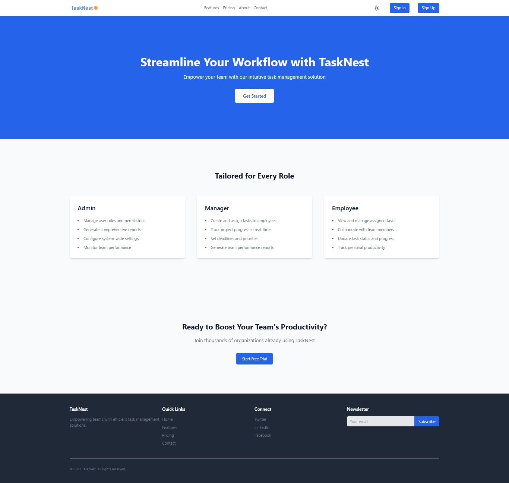
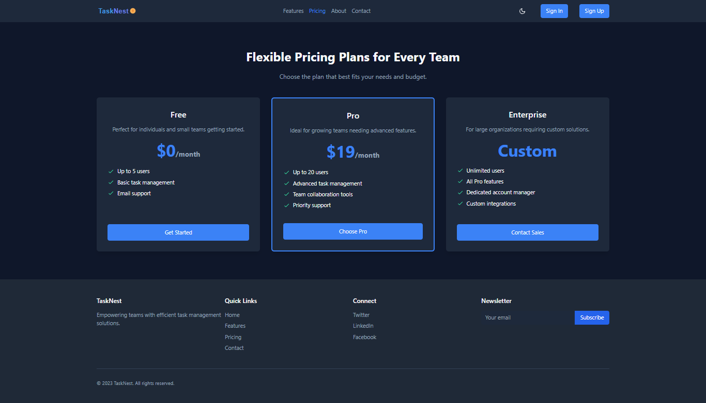

# TaskNest

A modern web-based task management system built with Django and Tailwind CSS.


## 📌 About

**TaskNest** is a full-featured task management system designed for teams and individuals to collaborate efficiently. Built with Django and Tailwind CSS, it supports user roles, project/task tracking, and real-time email notifications.

## Features

### User Management

- User registration with email activation.
- User login/logout.
- Password change.
- Password reset (email-based).
- Admin dashboard to view all users.
- Assign roles (Manager, Employee, Admin) to users.
- Create custom user groups with specific permissions.
- View list of user groups and their permissions.

### User Profiles

- Custom user profiles with bio and profile image.
- Edit profile information (email, first name, last name, bio, profile image).

### Task Management

- Create tasks with title, description, due date, and assigned users.
- Assign tasks to multiple users.
- Task details including priority (High, Medium, Low), notes, and an optional asset (image).
- View tasks (manager dashboard, employee dashboard).
- Update task details (status, priority, notes, asset).
- Delete tasks.
- Email notification to assigned users on task creation.

### Project Management

- Create projects with name, description, and start date.
- View projects with task counts.

### Role-Based Access Control (RBAC)

- Admin: Full access.
- Manager: Project management, task creation, task assignment, task updates, task deletion.
- Employee: View assigned tasks, update task status.

### Communication

- Contact form for user inquiries.

### Technical Aspects

- Backend: Django
- Frontend: Tailwind CSS
- Environment variable management using `python-decouple`.
- Database: PostgreSQL (configured for production).
- Static and media file handling.
- Email sending for account activation and task assignment.

## 📸 Screenshots

ℹ️ Note: This project is currently not deployed live due to paid service limitations. However, you can explore its full functionality through the provided screenshots and detailed instructions below.

### 🏠 Home Page

**Light Mode**



**Dark Mode**


### 🔐 Authentication

**Registration**


### 🚀 Core Features

**Manager Dashboard**


**Light Manager Dashboard**


**Task Status**

- **To-Do**


- **In Progress**


- **Completed**


**All Projects**


**Task Form**


### 👤 User Profile

**User Profile**


**Edit Profile**


**Change Password**


### 📄 Additional Pages

**Feature Page**


**Pricing Page**



**Contact Page**


### 📱 Responsive Design

**Home Page**


**Pricing Page**


**Contact Page**


### ⚙️ Admin Panel

**Django Admin**


## Setup and Installation

Follow these steps to set up and run the project locally.

### Prerequisites

- Python 3.x
- Node.js and npm
- PostgreSQL

### 1. Clone the repository

```bash
git clone https://github.com/MrMADS28289/task_management.git
cd tasknest
```

### 2. Create a Python Virtual Environment

```bash
python -m venv task_env
# On Windows
.\task_env\Scripts\activate
# On macOS/Linux
source task_env/bin/activate
```

### 3. Install Python Dependencies

```bash
pip install -r requirements.txt
```

### 4. Install Node.js Dependencies

```bash
npm install
```

### 5. Environment Variables

Create a `.env` file in the root directory of the project and add the following:

```
SECRET_KEY=your_secret_key_here
DEBUG=True
DB_PORT=5432
EMAIL_HOST=your_email_host
EMAIL_PORT=587
EMAIL_USE_TLS=True
EMAIL_HOST_USER=your_email@example.com
EMAIL_HOST_PASSWORD=your_email_password
```

For production, ensure you set `DEBUG=False` and configure the following database environment variables:

```
DB_NAME=your_production_db_name
DB_USER=your_production_db_user
DB_PASSWORD=your_production_db_password
DB_HOST=your_production_db_host
DB_PORT=your_production_db_port
```

Also, update `ALLOWED_HOSTS` in `tasknest/settings.py` with your production domain(s) or IP address(es).

To generate a `SECRET_KEY`, run:

```bash
python manage.py get_random_secret_key
```

### 6. Database Setup (PostgreSQL)

Ensure you have PostgreSQL running. Then, connect to your PostgreSQL server and create a database named `task_management`.

```sql
CREATE DATABASE tasknest;
```

### 7. Run Migrations

```bash
python manage.py makemigrations
python manage.py migrate
```

### 8. Build Tailwind CSS

```bash
npm run build:tailwind
```

### 9. Run the Development Server

```bash
python manage.py runserver
```

The application will be accessible at `http://127.0.0.1:8000/`

## Linting and Type Checking

### Ruff (Linting)

```bash
ruff check . --fix
```

### Mypy (Type Checking)

```bash
mypy .
```

## Populating the Database (Optional)

To populate your database with sample data, run:

```bash
python populate_db.py
```

## Project Structure

```
.env
manage.py
requirements.txt
package.json
...
core/
    models.py
    views.py
    ...
tasks/
    models.py
    views.py
    ...
users/
    models.py
    views.py
    ...
tasknest/
    settings.py
    urls.py
    ...
static/
    css/
    js/
    images/
media/
    profile_images/
    tasks_asset/
```

## 📡 API Endpoints

| Method | Endpoint            | Description       |
| ------ | ------------------- | ----------------- |
| GET    | /tasks/             | Get all tasks     |
| POST   | /tasks/create/      | Create a new task |
| PUT    | /tasks/update/{id}/ | Update task       |
| DELETE | /tasks/delete/{id}/ | Delete task       |

> **SEO-Optimized:** Easily indexable by recruiters and search engines via clear descriptions and rich documentation.

## 🧰 Technologies Used

- **Backend:** Django 5.1, PostgreSQL
- **Frontend:** HTML, Tailwind CSS, minimal JS
- **Styling:** Tailwind CSS
- **Environment:** Python-decouple, Ruff, Mypy

## 🧭 Roadmap

- [x] User authentication and profiles
- [x] Project and task CRUD
- [x] Role-based access
- [x] Email notifications
- [ ] Notifications UI
- [ ] REST API for frontend frameworks
- [ ] Real-time updates with Django Channels

## 🐛 Known Issues

- Task deletion does not remove associated media files.
- Email sometimes goes to spam during password reset.

## Contributing

Feel free to fork the repository and contribute. Pull requests are welcome.

## License

This project is licensed under the [MIT License](LICENSE).
